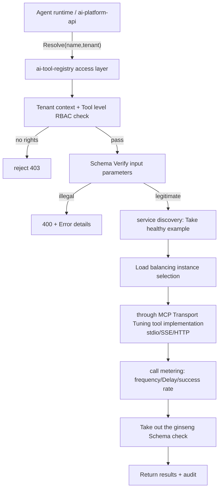
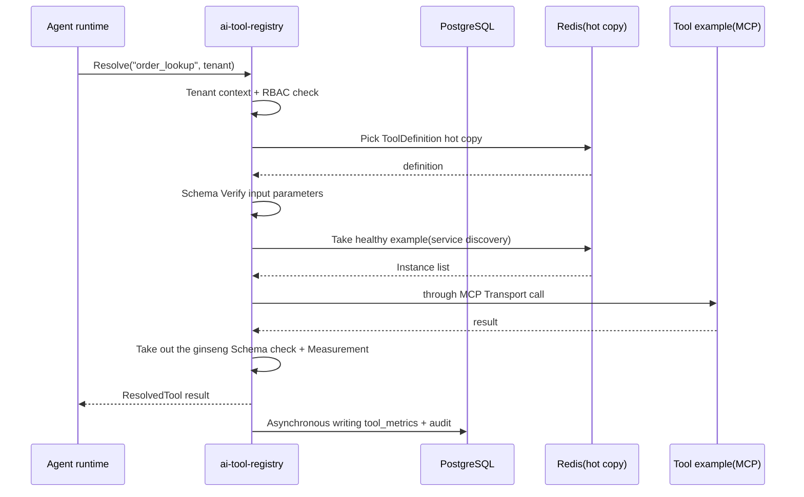

# ai-tool-registry · Detailed design

> **repo**: ai-tool-registry
> **Language · Framework**: Go · Gin + Cobra + Wire (DDD four layers; hot path can be Hertz/go-zero)
> **Field**: agent-infra (Agent infrastructure layer · Tool registration center)
> **optional**: false (core · core, the core of the Agent calling tool)
> **Platform version**: v1.0.0
> **Document Status**: Draft
> **Responsible Person**: OpenStrata Architecture Group
> **Associated links**: This repository [arch/ARCH.md](../../arch/ARCH.md) · [skills/SKILLS.md](../../skills/SKILLS.md) · [specs/SPECS.md](../../specs/SPECS.md); Architecture design document §4.3.2 (Tool Registration Center) · §7 (Skills/Rules/Specs Management) · §4.3.5 (AgentSpec Tool Binding) · §10.3 (ToolRegistry SPI) · §10.6 (Component Registry) · §15.5 (DDD Layering) · §16 (BOM)

---

## 1. Positioning and Boundary (Scope)

`ai-tool-registry` is the **tool registry** of OpenStrata, hosting §4.3.2 "Tool Registration Center" and §7 "Skills / Rules / Specs Management Platform". It uniformly manages the registration, Schema verification, service discovery, authentication and call metering of Tools and Skills/Rules/Specs that can be called by Agent. It is the only management surface for Agent to call external capabilities through `ToolRegistry` SPI.

- **The only problem solved by this repository**: Converging "tools (DB/API/File/Code/Search/Business) scattered everywhere" and "Platform-level capability packages (Skill/Rule/Spec)" into a **declarable, verifiable, discoverable, and manageable** registry, so that the Agent can access them uniformly according to `tool_bindings` (§4.3.5) when running.
- **Required**: core (recommended, §10.2 "Tool Registration Center"). This component is not available when the Agent cannot call the tool; it can be omitted in pure API gateway scenarios, but it is enabled by default in standard deployment.
- **Division of labor with other Go components**:
- **vs ai-gateway-core**: The gateway is responsible for the "model calling" data side; the repository is responsible for the "tool calling" management side. The two are connected in series in the link: Agent calls the tool → own repository analysis/authentication/measurement → tool implementation (may then adjust the model through the gateway).
- **vs ai-sandbox-manager**: After the `Tool` (such as code tool) that executes the code is registered in this repository, the runtime is carried by `SandboxExecutor` (§10.6 Dependency rule `Tool → SandboxExecutor`); this repository does not execute the code, only registration and routing.
- **vs ai-platform-api**: The control plane does tenant/user-level authorization summary; this repository does tool-level RBAC and instance discovery.
- **vs ai-cli**: `aictl` registers/queries tools and capability packages through the repository API.

---

## 2. Responsibilities List

| # | Responsibilities | Required/Optional | Description |
| --- | --- | --- | --- |
| R1 | Tool registration/de-registration | core | YAML/JSON declaration tool Schema, automatically generate call contract (§4.3.2) |
| R2 | Schema verification | core (recommended) | Input/output JSON Schema verification (§4.3.2) |
| R3 | Service discovery | optional | Automatic registration of tool instances, load balancing |
| R4 | Tool Authentication (RBAC) | optional (can be skipped by single user) | Tool-level API Key / OAuth2 (§4.3.2) |
| R5 | Call metering | optional | Number of calls, delay, success rate (§4.3.2) |
| R6 | Skills management | optional (default off) | Skill package registration/version/binding (§7.2) |
| R7 | Rules management | optional (default off) | OPA/Rego rule package registration (§7.3) |
| R8 | Specs Management | optional (default off) | AgentSpec Template/Specification Registration (§7.4, §4.3.5) |
| R9 | MCP protocol access | Register with the tool | stdio / SSE / HTTP three transports (§4.3.2) |

---

## 3. Core abstraction and interface (core interfaces / type definition)

The domain layer (§15.5.2 `domain/`) defines the `ToolRegistry` Port and capability package entities.

```go
package domain

// ===== ToolRegistry SPI（§10.3）=====
type ToolRegistry interface {
    Register(ctx context.Context, def ToolDefinition) (ToolID, error)
    Deregister(ctx context.Context, id ToolID) error
    Resolve(ctx context.Context, name string, tenantID string) (ResolvedTool, error)
    List(ctx context.Context, tenantID string, filter ToolFilter) []ToolDefinition
    Validate(ctx context.Context, name string, input map[string]any) error // JSON Schema
}

type ToolDefinition struct {
    Name        string            `json:"name"`         //Unique, such as order_lookup
    Version     string            `json:"version"`
    Kind        string            `json:"kind"`         // db|api|file|code|search|business
    TenantID    string            `json:"tenant_id"`
    InputSchema map[string]any    `json:"input_schema"` // JSON Schema
    OutputSchema map[string]any   `json:"output_schema"`
    Transport   string            `json:"transport"`    // stdio|sse|http|local
    Endpoint    string            `json:"endpoint"`     //Instance address (populated by service discovery)
    Auth        ToolAuth          `json:"auth"`         // apikey|oauth2|none
    RBAC        []string          `json:"rbac"`         //allow role
    CapabilityTags []string       `json:"tags"`         //Semantic retrieval
}

type ResolvedTool struct {
    Def     ToolDefinition
    Instances []ToolInstance  //Multiple instances obtained by service discovery (load balancing)
}

type ToolInstance struct {
    Endpoint string
    Healthy  bool
    Weight   int
}

//===== Capability Package Entity (§7) =====
type Skill struct { ID string; Name string; Version string; Manifest map[string]any; TenantID string }
type Rule  struct { ID string; Name string; PolicyRego string; Severity string; TenantID string } // OPA/Rego
type Spec  struct { ID string; Name string; AgentSpecRef string; TenantID string }                 //Quote §4.3.5 AgentSpec
```

---

## 4. Processing pipeline/request path

Management path of tool call (take Agent calling `order_lookup` as an example):



> The registration path of the capability package (Skill/Rule/Spec) is "Declaration → Verification → Into the library → Can be referenced by AgentSpec", and does not use the runtime call link (§7).

---

## 5. Key algorithm/logic

### 5.1 Tool parsing and routing
`Resolve(name, tenant)`: First locate the `ToolDefinition` according to `tenant_id` + `name`, then verify the caller role according to `RBAC`, and finally get the healthy instance from `service_discovery` and select the instance randomly/polling according to `Weight`.

### 5.2 Schema verification
Input/output parameters are verified using JSON Schema (gojsonschema); illegal input parameters are intercepted at the gateway/registration center boundary to avoid contaminating the tool implementation (§4.3.2 "Schema Verification Recommendation").

### 5.3 Service Discovery
Tool instances are registered in the registry (or connected to K8s Endpoints) with heartbeats; periodic health detection eliminates unhealthy instances; multi-instance load balancing (optional) is supported.

### 5.4 Capability package version and reference
- **Skill**: Press `name+version` for immutable storage, AgentSpec refers to `skill_ref` to get the latest compatible version (semantic).
- **Rule**: Stores OPA/Rego text, providing `Evaluate(input)` sandbox execution (§7.3).
- **Spec**: Stores AgentSpec templates (§4.3.5) for low-code canvas/build path reference convergence.

---

## 6. Adaptation with external systems/components (OSS/SPI Adapter)

| SPI port | Role of this repository | External components | Default ✅ / Alternative | Adapter |
| --- | --- | --- | --- | --- |
| `ToolRegistry` | Implementer | This repository itself (no external SPI instance, self-developed port of the platform) | — | MCP protocol access (stdio/SSE/HTTP) |
| `VectorStore` (1.0.0) | Consumer (optional) | Qdrant (core) / Milvus (optional) | ✅ / Alternative | Tool semantic retrieval/tag vectorization (optional enhancement) |
| `Cache` (1.0.0) | Consumer | Redis (core) / Valkey (optional) | ✅ / Alternative | Registry hot copy, metering count |
| `Auth` (1.0.0) | Consumer | Keycloak (core) | ✅ | Tenant/User Identity |
| `Sandbox` (1.0.0) | Indirect dependency | Kata/E2B (optional) | Alternative | Code class Tool runs through `SandboxExecutor` (§10.6 Dependency rules) |

> `ToolRegistry` has no corresponding external instance** among the 15 SPI ports in bom.yaml (it is a self-developed port on the platform). Its "multiple implementations" are reflected in **the coexistence of multiple instances of the same tool** (service discovery), rather than external component replacement (§10.3, §10.4). Anti-corrosion layer: The differences between the three MCP Transports are converged into a unified `ResolvedTool` call in the Adapter.

---

## 7. API / CLI / Configuration interface

### 7.1 HTTP API（Gin）
```
POST /v1/tools                 #Registration tool
DELETE /v1/tools/{name}        #Anti-registration
GET  /v1/tools                 #List (filtered by tenant/tag)
POST /v1/tools/{name}/resolve  #Runtime parsing (before Agent call)
POST /v1/tools/{name}/invoke   #Proxy call (optional; or directly connected to the instance by the caller)
POST /v1/skills  GET /v1/skills       #Skills Management (§7.2)
POST /v1/rules   GET /v1/rules        #Rules management (§7.3)
POST /v1/specs   GET /v1/specs        #Specs Management (§7.4)
GET  /healthz  /metrics
```
### 7.2 CLI (optional, operation/declarative)
`aictl registry push ./tools/order_lookup.yaml` format (forwarded by `ai-cli`); this repository can also accept `--config` to start batch registration.
### 7.3 Configuration fragment (this repository `infrastructure/config/`)
```yaml
toolRegistry:
  schemaValidation: true        #Input and output parameters JSON Schema
  discovery:
    enabled: true               #service discovery
    heartbeatTTL: 30s
  mcp:
    transports: [stdio, sse, http]
  metering:
    enabled: true               #call metering
auth:
  provider: keycloak
skills:
  enabled: false                #optional default off (§10.2)
rules:
  enabled: false
specs:
  enabled: false
```

---

## 8. Data model and storage

Persistence (base/core):
- **PostgreSQL** (core): `tools` (tool definition), `tool_instances` (service discovery), `skills`/`rules`/`specs` (capability package), `tool_metrics` (measurement), `audit_log`.
- **Redis** (core): registry hot copy, metering sliding window, rate limiting.

```sql
CREATE TABLE tools (
  name        TEXT NOT NULL,
  tenant_id   TEXT NOT NULL,
  version     TEXT NOT NULL,
  kind        TEXT,
  input_schema  JSONB,
  output_schema JSONB,
  transport   TEXT,
  endpoint    TEXT,
  auth        JSONB,
  rbac        JSONB,
  tags        JSONB,
  PRIMARY KEY (tenant_id, name, version)
);
```

---

## 9. Concurrency and performance (goroutine / pool / back pressure)

- **Framework**: Gin handles the management/registration API; `Resolve` is a hot path and can go to Hertz/go-zero (§15.5.1).
- **Goroutine**: One goroutine per request; tool proxy call (`invoke`) is controlled by context timeout; metering is asynchronously dropped via `chan` + background worker.
- **Read more and write less**: The hot copy of the registry is stored in Redis + local `sync.RWMutex` protected `map`, double-write fails during registration/unregistration; `Resolve` uses local cache, millisecond level.
- **Backpressure**: Use semaphores to limit the concurrency of tool instances; when downstream tools respond slowly, they will time out and return without piling up goroutines.
- **Stateless**: No local state except for rebuildable cache, and can be scaled horizontally.

---

## 10. Key sequence diagram (Mermaid)



---

## 11. Configuration and deployment (including K8s resources/probes)

- **Deployment form**: core, deployed in the `ai-system` namespace (§9.2); Stages 1 to 3 of Compose/K8s, with the standard file turned on Skills/Rules/Specs (profiles `optional_disabled` control).
- **Resources** (reference): requests cpu 250m / mem 256Mi; limits cpu 1 / mem 1Gi.
- **Probe**: Alive `GET /healthz`; ready `GET /healthz` (check PG/Redis). `initialDelaySeconds: 5`, period `10s`.
- **Rolling update**: multiple copies + probe keepalive (§13.3).
- **Optional component start and stop**: Skills/Rules/Specs is turned off by default (§10.2), and can be turned on by configuring `skills.enabled=true` under `ai-system`; starting and stopping does not affect core tool registration (the core path does not depend on the capability package).

---

## 12. Observability / Security

- **Observability (§4.8)**: Basic OTel traces + audit (core); Prometheus (number of registrations, Resolve QPS, number of calls/latency/success rate, Schema verification failure rate).
- **Security (§4.3.2 / §4.7.4)**: Tool-level RBAC (API Key / OAuth2); basic risk control (rate limiting) pushed down to core; calling full audit (core). Keycloak access is recommended for multi-user scenarios (§4.7.3).

---

## 13. Testing strategy

- **Unit testing**: Schema verification, RBAC determination, service discovery instance selection, version compatibility analysis (domain layer pure logic, §15.5.5).
- **SPI/Contract Test**: MCP three Transport Adapters run the same contract (register→resolve→invoke→parameter verification).
- **Integration test**: testcontainers starts with PG+Redis, and verifies registration/discovery/measurement.
- **Stress Test**: `Resolve` hot path target p99 ≤ 5ms (local cache hit); `invoke` proxy path depends on the downstream tool. Focus on measuring the consistency of hot replicas under concurrent registration/de-registration.

---

## 14. Open questions

1. **Relationship between capability packages and Component Registry**: Are Skills/Rules/Specs included in the unified instance metadata of §10.6 Component Registry? Or is it only managed within the tool registry? Need to be aligned with `ai-platform-api`.
2. **Attribution of tool call metering**: Are tool call delays/costs incorporated into the `ai-billing-service` tenant bill? Or just internal metrics?
3. **Sandbox binding timing of code class Tool**: Declaring `kind: code` when registering is mandatory to require `ai-sandbox-manager` to be online (§10.6 Dependency Rules)? Weak dependence or strong dependence?
4. **Cross-tenant tool sharing**: Are platform-level public tools (such as weather queries) allowed to be visible across tenants? Requires RBAC model extensions.
5. **MCP SSE/HTTP long connection management**: The connection pool and timeout strategy for a large number of SSE tool connections are to be determined.

---

## Change record

| Version | Date | Author | Description |
| --- | --- | --- | --- |
| v0.1 | 2026-07-17 | OpenStrata Architecture Group | First draft (covering the placeholder skeleton, complete with 14 sections) |

## Traceability Matrix (Chapter of this document ↔ Architecture Design Document § Number)

| Chapter | Corresponding Architecture § |
| --- | --- |
| 1 Positioning and Boundaries | §4.3.2, §7, §10.2, §15.5 |
| 2 Responsibilities List | §4.3.2, §7.2–7.4 |
| 3 Core abstractions and interfaces | §4.3.2, §4.3.5, §10.3 |
| 4 Processing Pipeline | §4.3.2, §4.3.5 |
| 5 Key Algorithms | §4.3.2, §7.2–7.4, §10.6 |
| 6 External adaptation | §4.3.2, §10.3, §10.4, §10.6, §16 |
| 7 API/CLI/Configuration | §4.3.2, §7, §12 |
| 8 Data Model | §4.8, §16(base) |
| 9 Concurrency and Performance | §15.5.1, §15.5.5 |
| 10 Timing diagram | §4.3.2, §15.5.2.2 |
| 11 Configuration Deployment | §9.2, §12.2, §13.3 |
| 12 Observability/Security | §4.3.2, §4.7.3, §4.7.4, §4.8 |
| 13 Testing Strategy | §15.5.5 |
| 14 Open Questions | §7, §10.6 |
