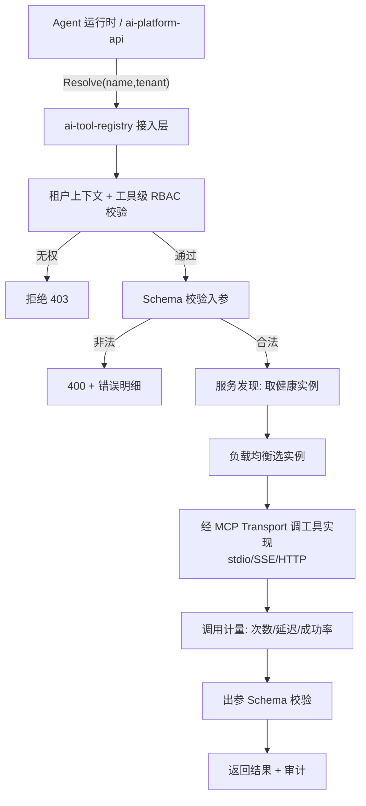
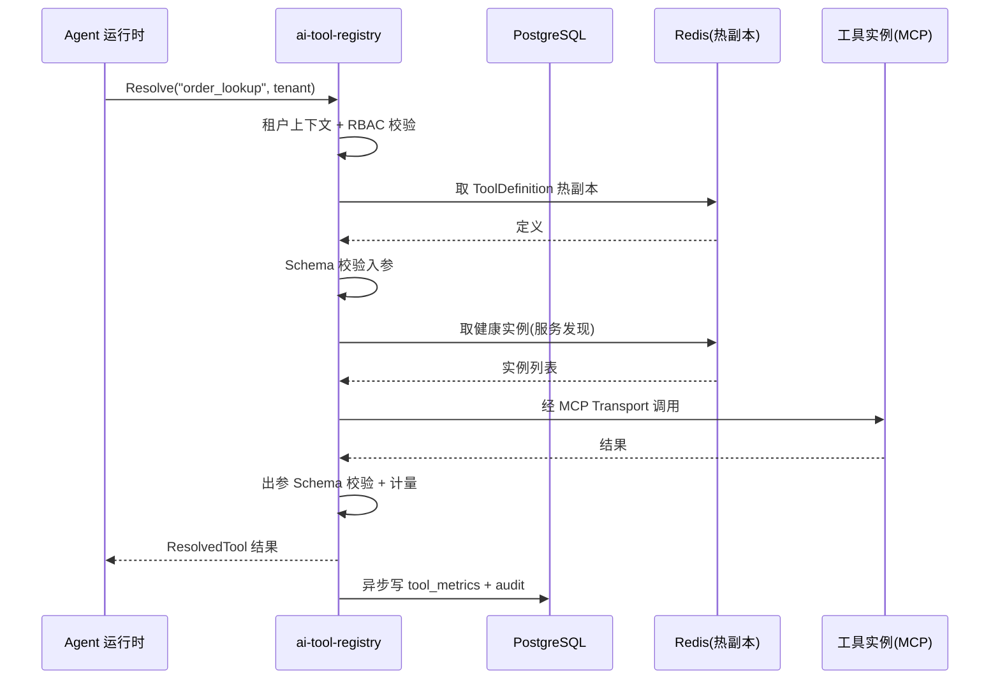

# ai-tool-registry · 详细设计

> **repo**: ai-tool-registry
> **语言·框架**: Go · Gin + Cobra + Wire（DDD 四层；热路径可上 Hertz/go-zero）
> **领域**: agent-infra（Agent 基础设施层 · 工具注册中心）
> **optional**: false（核心 · core，Agent 调用工具的核心）
> **平台版本**: v1.4.0
> **文档状态**: 草稿
> **负责人**: OpenStrata 架构组
> **关联链接**: 本仓 [arch/ARCH.md](../../arch/ARCH.md) · [skills/SKILLS.md](../../skills/SKILLS.md) · [specs/SPECS.md](../../specs/SPECS.md) ；架构设计文档 §4.3.2（工具注册中心）· §7（Skills/Rules/Specs 管理）· §4.3.5（AgentSpec 工具绑定）· §10.3（ToolRegistry SPI）· §10.6（Component Registry）· §15.6（DDD 分层）· §16（BOM）

---

## 1. 定位与边界（Scope）

`ai-tool-registry` 是 OpenStrata 的**工具注册中心**，承载 §4.3.2「工具注册中心」与 §7「Skills / Rules / Specs 管理平台」。它统一管理 Agent 可调用的**工具（Tool）**与**能力包（Skills / Rules / Specs）**的注册、Schema 校验、服务发现、鉴权与调用计量，是 Agent 经 `ToolRegistry` SPI 调用外部能力的唯一治理面。

- **本仓解决的唯一问题**：把"分散在各处的工具（DB/API/文件/代码/搜索/业务）"与"平台级能力包（Skill/Rule/Spec）"收敛为**可声明、可校验、可发现、可治理**的注册表，让 Agent 运行时按 `tool_bindings`（§4.3.5）统一取用。
- **必选性**：core（推荐，§10.2「工具注册中心」）。Agent 无法调用工具时无此组件则不可用；纯 API 网关场景可省，但标准部署默认开。
- **与其他 Go 组件的分工**：
  - **vs ai-gateway-core**：网关负责"模型调用"数据面；本仓负责"工具调用"治理面。二者在链路中串联：Agent 调用工具 → 本仓解析/鉴权/计量 → 工具实现（可能再经网关调模型）。
  - **vs ai-sandbox-manager**：执行代码的 `Tool`（如代码工具）经本仓注册后，运行时由 `SandboxExecutor` 承载（§10.6 依赖规则 `Tool → SandboxExecutor`）；本仓不执行代码，只登记与路由。
  - **vs ai-platform-api**：控制面做租户/用户级授权汇总；本仓做工具级 RBAC 与实例发现。
  - **vs ai-cli**：`aictl` 通过本仓 API 注册/查询工具与能力包。

---

## 2. 职责清单

| # | 职责 | 必选/可选 | 说明 |
| --- | --- | --- | --- |
| R1 | 工具注册 / 反注册 | core | YAML/JSON 声明工具 Schema，自动生成调用契约（§4.3.2） |
| R2 | Schema 校验 | core（推荐） | 入参/出参 JSON Schema 校验（§4.3.2） |
| R3 | 服务发现 | optional | 工具实例自动注册、负载均衡 |
| R4 | 工具鉴权（RBAC） | optional（单用户可跳过） | 工具级 API Key / OAuth2（§4.3.2） |
| R5 | 调用计量 | optional | 调用次数、延迟、成功率（§4.3.2） |
| R6 | Skills 管理 | optional（默认关） | 技能包注册/版本/绑定（§7.2） |
| R7 | Rules 管理 | optional（默认关） | OPA/Rego 规则包注册（§7.3） |
| R8 | Specs 管理 | optional（默认关） | AgentSpec 模板 / 规范注册（§7.4，§4.3.5） |
| R9 | MCP 协议接入 | 随工具注册 | stdio / SSE / HTTP 三种 Transport（§4.3.2） |

---

## 3. 核心抽象与接口（core interfaces / 类型定义）

领域层（§15.6.2 `domain/`）定义 `ToolRegistry` Port 与能力包实体。

```go
package domain

// ===== ToolRegistry SPI（§10.3）=====
type ToolRegistry interface {
    Register(ctx context.Context, def ToolDefinition) (ToolID, error)
    Deregister(ctx context.Context, id ToolID) error
    Resolve(ctx context.Context, name string, tenantID string) (ResolvedTool, error)
    List(ctx context.Context, tenantID string, filter ToolFilter) []ToolDefinition
    Validate(ctx context.Context, name string, input map[string]any) error // JSON Schema
}

type ToolDefinition struct {
    Name        string            `json:"name"`         // 唯一，如 order_lookup
    Version     string            `json:"version"`
    Kind        string            `json:"kind"`         // db|api|file|code|search|business
    TenantID    string            `json:"tenant_id"`
    InputSchema map[string]any    `json:"input_schema"` // JSON Schema
    OutputSchema map[string]any   `json:"output_schema"`
    Transport   string            `json:"transport"`    // stdio|sse|http|local
    Endpoint    string            `json:"endpoint"`     // 实例地址（服务发现填充）
    Auth        ToolAuth          `json:"auth"`         // apikey|oauth2|none
    RBAC        []string          `json:"rbac"`         // 允许 role
    CapabilityTags []string       `json:"tags"`         // 语义检索
}

type ResolvedTool struct {
    Def     ToolDefinition
    Instances []ToolInstance  // 服务发现得到的多实例（负载均衡）
}

type ToolInstance struct {
    Endpoint string
    Healthy  bool
    Weight   int
}

// ===== 能力包实体（§7）=====
type Skill struct { ID string; Name string; Version string; Manifest map[string]any; TenantID string }
type Rule  struct { ID string; Name string; PolicyRego string; Severity string; TenantID string } // OPA/Rego
type Spec  struct { ID string; Name string; AgentSpecRef string; TenantID string }                 // 引用 §4.3.5 AgentSpec
```

---

## 4. 处理流水线 / 请求路径

工具调用的治理路径（以 Agent 调用 `order_lookup` 为例）：



> 能力包（Skill/Rule/Spec）注册路径为「声明 → 校验 → 入库 → 可被 AgentSpec 引用」，不走运行时调用链路（§7）。

---

## 5. 关键算法 / 逻辑

### 5.1 工具解析与路由
`Resolve(name, tenant)`：先按 `tenant_id` + `name` 定位 `ToolDefinition`，再据 `RBAC` 校验 caller role，最后从 `service_discovery` 取健康实例并按 `Weight` 加权随机/轮询选实例。

### 5.2 Schema 校验
入参/出参用 JSON Schema（gojsonschema）校验；非法入参在网关/注册中心边界即拦截，避免污染工具实现（§4.3.2「Schema 校验推荐」）。

### 5.3 服务发现
工具实例以心跳注册到注册表（或对接 K8s Endpoints）；周期性健康探测剔除不健康实例；支持多实例负载均衡（optional）。

### 5.4 能力包版本与引用
- **Skill**：按 `name+version` 不可变存储，AgentSpec 引用 `skill_ref` 取最新兼容版本（语义化）。
- **Rule**：存储 OPA/Rego 文本，提供 `Evaluate(input)` 沙箱执行（§7.3）。
- **Spec**：存储 AgentSpec 模板（§4.3.5），供低代码画布/构建路径引用收敛。

---

## 6. 与外部系统/组件的适配（OSS / SPI Adapter）

| SPI 端口 | 本仓角色 | 外部组件 | 默认 ✅ / 备选 | Adapter |
| --- | --- | --- | --- | --- |
| `ToolRegistry` | 实现方 | 本仓自身（无外部 SPI 实例，属平台自研 Port） | — | MCP 协议接入（stdio/SSE/HTTP） |
| `VectorStore` (1.1.0) | 消费方（可选） | Qdrant（core）/ Milvus（optional） | ✅ / 备选 | 工具语义检索/标签向量化（可选增强） |
| `Cache` (1.0.0) | 消费方 | Redis（core）/ Valkey（optional） | ✅ / 备选 | 注册表热副本、计量计数 |
| `Auth` (1.0.0) | 消费方 | Keycloak（core） | ✅ | 租户/用户身份 |
| `Sandbox` (1.0.0) | 间接依赖 | Kata/E2B（optional） | 备选 | 代码类 Tool 运行时经 `SandboxExecutor`（§10.6 依赖规则） |

> `ToolRegistry` 在 bom.yaml 的 15 个 SPI 端口中**无对应外部实例**（属平台自研 Port），其"多实现"体现为**同一工具的多实例并存**（服务发现），而非外部组件替换（§10.3、§10.4）。防腐层：MCP 三种 Transport 的差异在 Adapter 内收敛为统一 `ResolvedTool` 调用。

---

## 7. API / CLI / 配置接口面

### 7.1 HTTP API（Gin）
```
POST /v1/tools                 # 注册工具
DELETE /v1/tools/{name}        # 反注册
GET  /v1/tools                 # 列出（按租户/标签过滤）
POST /v1/tools/{name}/resolve  # 运行时解析（Agent 调用前）
POST /v1/tools/{name}/invoke   # 代理调用（可选；或直接由调用方直连实例）
POST /v1/skills  GET /v1/skills       # Skills 管理（§7.2）
POST /v1/rules   GET /v1/rules        # Rules 管理（§7.3）
POST /v1/specs   GET /v1/specs        # Specs 管理（§7.4）
GET  /healthz  /metrics
```
### 7.2 CLI（可选，运维/声明式）
`aictl registry push ./tools/order_lookup.yaml` 形式（由 `ai-cli` 转发）；本仓亦可接受 `--config` 启动批量注册。
### 7.3 配置片段（本仓 `infrastructure/config/`）
```yaml
toolRegistry:
  schemaValidation: true        # 入出参 JSON Schema
  discovery:
    enabled: true               # 服务发现
    heartbeatTTL: 30s
  mcp:
    transports: [stdio, sse, http]
  metering:
    enabled: true               # 调用计量
auth:
  provider: keycloak
skills:
  enabled: false                # optional 默认关（§10.2）
rules:
  enabled: false
specs:
  enabled: false
```

---

## 8. 数据模型与存储

持久化（base/core）：
- **PostgreSQL**（core）：`tools`（工具定义）、`tool_instances`（服务发现）、`skills`/`rules`/`specs`（能力包）、`tool_metrics`（计量）、`audit_log`。
- **Redis**（core）：注册表热副本、计量滑动窗口、限流。

```sql
CREATE TABLE tools (
  name        TEXT NOT NULL,
  tenant_id   TEXT NOT NULL,
  version     TEXT NOT NULL,
  kind        TEXT,
  input_schema  JSONB,
  output_schema JSONB,
  transport   TEXT,
  endpoint    TEXT,
  auth        JSONB,
  rbac        JSONB,
  tags        JSONB,
  PRIMARY KEY (tenant_id, name, version)
);
```

---

## 9. 并发与性能（goroutine / pool / 背压）

- **框架**：Gin 处理管理/注册 API；`Resolve` 为热路径，可上 Hertz/go-zero（§15.6.1）。
- **Goroutine**：每请求一 goroutine；工具代理调用（`invoke`）用 context 超时控制；计量经 `chan` + 后台 worker 异步落库。
- **读多写少**：注册表热副本存 Redis + 本地 `sync.RWMutex` 保护的 `map`，注册/反注册时双写失效；`Resolve` 走本地缓存，毫秒级。
- **背压**：工具实例并发上限用信号量；下游工具慢响应时超时即返回，不堆积 goroutine。
- **无状态**：除可重建缓存外无本地状态，可水平扩缩。

---

## 10. 关键时序图（Mermaid）



---

## 11. 配置与部署（含 K8s 资源/探针）

- **部署形态**：core，部署于 `ai-system` 命名空间（§9.2）；阶段一~三 Compose/K8s，随 standard 档点亮 Skills/Rules/Specs（profiles `optional_disabled` 控制）。
- **资源**（参考）：requests cpu 250m / mem 256Mi；limits cpu 1 / mem 1Gi。
- **探针**：存活 `GET /healthz`；就绪 `GET /healthz`（校验 PG/Redis）。`initialDelaySeconds: 5`，period `10s`。
- **滚动更新**：多副本 + 探针保活（§13.3）。
- **可选组件启停**：Skills/Rules/Specs 默认关（§10.2），由 `ai-system` 下配置 `skills.enabled=true` 等开启；启停不影响核心工具注册（核心路径不依赖能力包）。

---

## 12. 可观测性 / 安全

- **可观测性（§4.8）**：基础 OTel traces + 审计（core）；Prometheus（注册数、Resolve QPS、调用次数/延迟/成功率、Schema 校验失败率）。
- **安全（§4.3.2 / §4.7.4）**：工具级 RBAC（API Key / OAuth2）；基础风控（限流）下沉 core；调用全量审计（core）。多用户场景推荐 Keycloak 接入（§4.7.3）。

---

## 13. 测试策略

- **单元测试**：Schema 校验、RBAC 判定、服务发现选实例、版本兼容解析（领域层纯逻辑，§15.6.5）。
- **SPI/契约测试**：MCP 三种 Transport Adapter 跑同一契约（注册→resolve→invoke→出参校验）。
- **集成测试**：testcontainers 起 PG+Redis，验证注册/发现/计量落库。
- **压测**：`Resolve` 热路径目标 p99 ≤ 5ms（本地缓存命中）；`invoke` 代理路径随下游工具。重点测高并发注册/反注册下热副本一致性。

---

## 14. 开放问题

1. **能力包与 Component Registry 的关系**：Skills/Rules/Specs 是否纳入 §10.6 Component Registry 的统一实例元数据？还是仅在工具注册中心内管理？需与 `ai-platform-api` 对齐。
2. **工具调用计量的归属**：工具调用延迟/成本是否并入 `ai-billing-service` 租户账单？还是仅内部指标？
3. **代码类 Tool 的沙箱绑定时机**：注册时声明 `kind: code` 是否强制要求 `ai-sandbox-manager` 在线（§10.6 依赖规则）？弱依赖还是强依赖？
4. **跨租户工具共享**：平台级公共工具（如天气查询）是否允许跨租户可见？需 RBAC 模型扩展。
5. **MCP SSE/HTTP 的长连接治理**：大量 SSE 工具连接下的连接池与超时策略待定。

---

## 变更记录

| 版本 | 日期 | 作者 | 说明 |
| --- | --- | --- | --- |
| v0.1 | 2026-07-17 | OpenStrata 架构组 | 初稿（覆盖占位骨架，14 节完整） |

## 追溯矩阵（本文档章节 ↔ 架构设计文档 § 编号）

| 章节 | 对应架构 § |
| --- | --- |
| 1 定位与边界 | §4.3.2, §7, §10.2, §15.6 |
| 2 职责清单 | §4.3.2, §7.2–7.4 |
| 3 核心抽象与接口 | §4.3.2, §4.3.5, §10.3 |
| 4 处理流水线 | §4.3.2, §4.3.5 |
| 5 关键算法 | §4.3.2, §7.2–7.4, §10.6 |
| 6 外部适配 | §4.3.2, §10.3, §10.4, §10.6, §16 |
| 7 API/CLI/配置 | §4.3.2, §7, §12 |
| 8 数据模型 | §4.8, §16(base) |
| 9 并发与性能 | §15.6.1, §15.6.5 |
| 10 时序图 | §4.3.2, §15.6.2.2 |
| 11 配置部署 | §9.2, §12.2, §13.3 |
| 12 可观测性/安全 | §4.3.2, §4.7.3, §4.7.4, §4.8 |
| 13 测试策略 | §15.6.5 |
| 14 开放问题 | §7, §10.6 |
